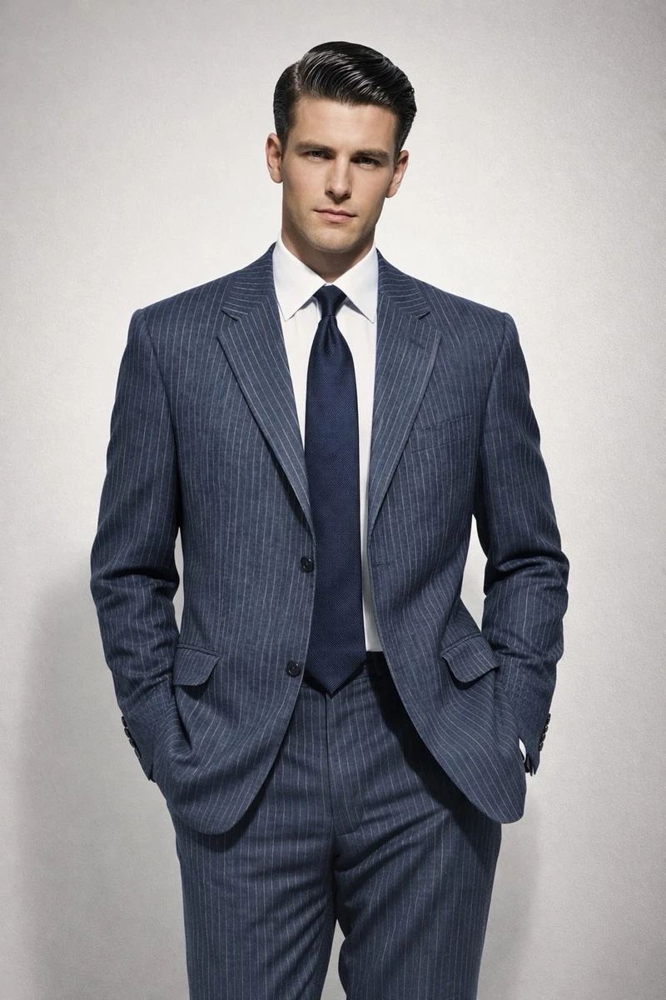
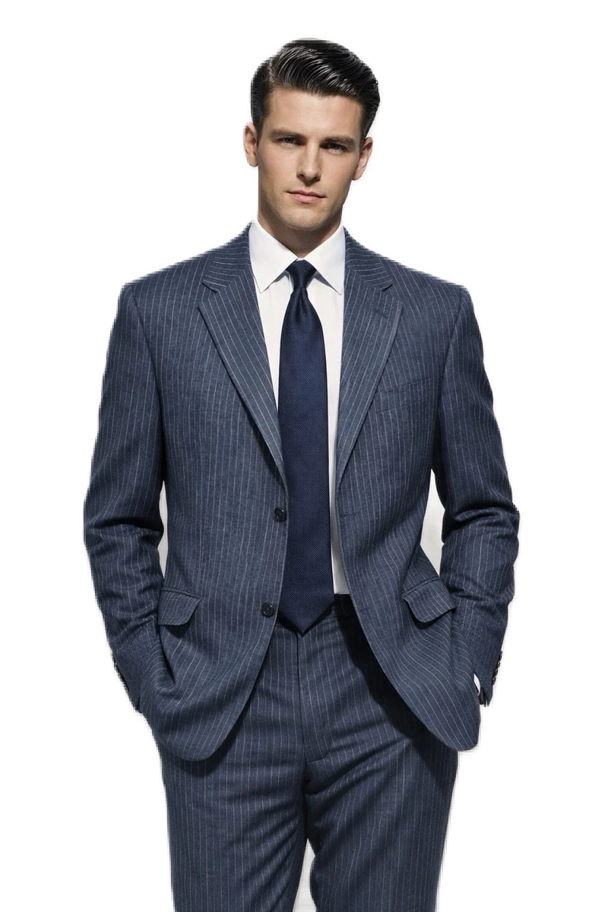
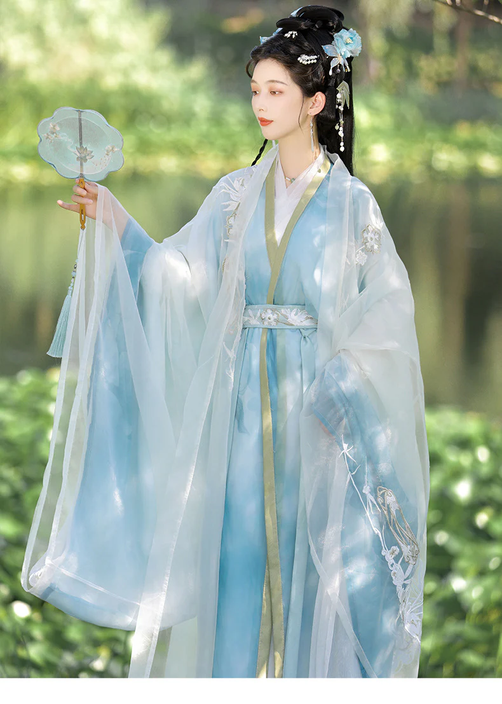
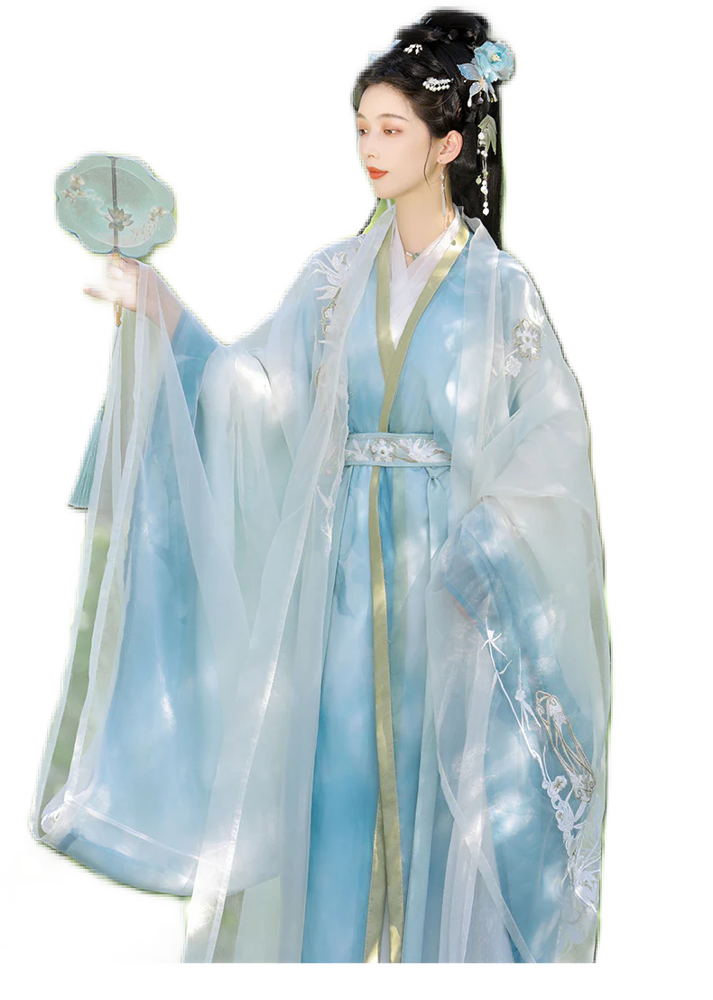

# AI 抠图应用

基于 Flutter + ONNX Runtime 的智能背景移除应用，使用 U2-Net 轻量模型（u2netp）实现端侧实时抠图。

## 背景：从传统抠图到 AI 抠图

### 传统 OpenCV 抠图

在深度学习普及之前，图像抠图主要依赖 OpenCV 提供的传统计算机视觉算法。以下是几种代表性方法：

#### 1. GrabCut（交互式前景提取）

OpenCV 中最常用的抠图方法。算法基于图割（Graph Cut）理论，将图像建模为一个图结构，像素为节点，相邻像素之间的颜色差异为边的权重。用户提供一个包含前景的矩形框，算法通过高斯混合模型（GMM）对前景和背景分别建模，然后迭代优化分割边界。

```
典型流程：
用户框选区域 → GMM 建模前景/背景颜色分布 → 图割求解最优分割 → 迭代细化
```

**局限性：** 必须人工框选初始区域，对头发丝、半透明物体、前景背景颜色相近的区域效果差。迭代过程耗时，不适合实时场景。

#### 2. 阈值分割（Thresholding）

最简单直接的方法。将图像转为灰度图或 HSV 色彩空间，设定一个或多个阈值，将像素分为前景和背景两类。常见变体包括固定阈值、自适应阈值（按局部区域计算阈值）和 Otsu 自动阈值（根据灰度直方图的双峰分布自动计算最优阈值）。

**局限性：** 只在前景和背景颜色差异明显时有效（如白底黑字文档）。自然场景中光照不均、颜色渐变、阴影等都会导致分割失败。

#### 3. 轮廓检测（Contour Detection）

先通过 Canny 等边缘检测算子提取图像边缘，再用 `findContours` 找到封闭轮廓，最后根据轮廓面积、形状等条件筛选出前景区域。通常配合形态学操作（膨胀、腐蚀）来填充轮廓内部空洞。

**局限性：** 边缘检测对噪声极为敏感，参数（Canny 的高低阈值）需要针对每张图调整。纹理丰富的前景会产生大量伪边缘，导致轮廓破碎。

#### 4. 背景差分（Background Subtraction）

在已知背景的前提下，将当前帧与背景帧逐像素求差，差异超过阈值的区域视为前景。OpenCV 提供了 `MOG2`（基于高斯混合模型的自适应背景建模）和 `KNN`（K近邻背景建模）两种背景减除器，可以处理缓慢变化的背景。

**局限性：** 必须有事先拍摄的纯背景帧，或者使用固定摄像头逐帧积累背景模型。无法应用于单张图片抠图，只适合视频监控等特定场景。

#### 5. 分水岭算法（Watershed）

将图像的灰度值看作地形高度，从用户标记的"种子点"开始注水，水位上升过程中不同注水源的交汇线即为分割边界。OpenCV 中通常先做距离变换找到前景中心，再用分水岭求精确边界。

**局限性：** 对种子点的位置敏感，标记不当会导致过分割（一个物体被分成多块）或欠分割。需要人工标注或启发式规则来确定种子，自动化程度低。

#### 传统方法的根本瓶颈

以上方法的共同问题是**依赖人工设定规则或交互，无法理解图像语义**。它们只能处理底层视觉特征（颜色、边缘、纹理），不知道"这是一个人"或"这是一件衣服"。当场景复杂时——杂乱背景、前景与背景颜色相近、细碎边缘（头发、毛发、网状物）——效果急剧下降，且每种场景都需要重新调参。

### AI 抠图的突破

深度学习从根本上改变了抠图的方式。神经网络通过在大量人工标注的（图像, mask）配对数据上训练，学习到"什么是前景"的高层语义理解，直接从原始像素输出逐像素的分割概率图：

```
传统方法：  图像 → 手工特征（颜色/边缘/纹理） → 规则判断 → mask
AI 方法：   图像 → 神经网络（自动提取特征 + 语义理解） → mask
```

相比传统方法的核心优势：

- **端到端处理** — 输入原图，直接输出 mask，无需人工框选、标记种子或调参
- **语义理解** — 能识别人、动物、衣物、车辆等具体类别，知道"前景是什么"
- **边缘精度** — 对头发丝、毛发、半透明物体等复杂边缘的处理远优于传统方法
- **泛化能力** — 训练数据覆盖多种场景后，同一个模型可以处理各类背景，无需逐场景调参
- **可批量化** — 不需要人工交互，可以自动处理大量图片

## AI 抠图方案对比

### U2-Net

[U2-Net](https://github.com/xuebinqin/U-2-Net)（U-Square Net）由 Xuebin Qin 等人于 2020 年在论文 *"U2-Net: Going Deeper with Nested U-Structure for Salient Object Detection"* 中提出，用于显著性目标检测（Salient Object Detection, SOD）任务——即从图像中找出最吸引人注意力的主体区域。

#### 网络结构

U2-Net 的核心创新是**两层嵌套的 U 型结构**：

```
外层：经典的 U-Net 编码器-解码器结构（逐级下采样再上采样）
内层：每个编码/解码阶段内部，再嵌套一个小型 U-Net（称为 RSU, ReSidual U-block）
```

传统 U-Net 的每个阶段只是几层卷积，而 U2-Net 的每个阶段本身就是一个完整的小 U-Net。这种嵌套设计让网络在不同尺度上都能捕获局部细节和全局上下文信息，而不需要依赖 ImageNet 预训练的骨干网络（如 ResNet、VGG），因此模型结构自包含、完整独立。

RSU 模块有不同深度的变体（RSU-7、RSU-6、RSU-5、RSU-4、RSU-4F），编码器浅层使用深度更大的 RSU 处理高分辨率特征图，深层使用较浅的 RSU 处理低分辨率特征图，平衡了精度和计算量。

#### 模型输出

U2-Net 有 7 个输出（6 个侧输出 + 1 个融合输出），训练时对每个输出都计算损失函数以实现深监督。推理时使用第一个输出（融合输出 `d0`），它综合了所有尺度的信息，质量最高。

#### 两个版本

| 版本 | 参数量 | 模型大小 | 特点 |
|------|--------|---------|------|
| **u2net** | 44.0M | ~176MB | 完整版，RSU 模块通道数更多（64→512），精度最高 |
| **u2netp** | 1.1M | ~4.7MB | 轻量版，RSU 模块通道数缩减（16→64），体积仅为完整版的 1/37 |

u2netp 通过大幅减少每层卷积的通道数来压缩模型，网络的整体拓扑结构与 u2net 完全相同，因此仍保留了嵌套 U 型结构的多尺度特征提取能力。

### rembg

[rembg](https://github.com/danielgatis/rembg) 是一个流行的 Python 开源背景移除工具库（GitHub 17k+ stars）。它并不是一个独立的模型，而是对多种分割模型的**上层封装**，提供了统一的 API 来调用不同的后端模型。

#### 工作流程

```
输入图像 → 预处理（缩放、归一化）→ 模型推理 → 后处理 → alpha matting 细化（可选）→ 输出
```

rembg 在模型推理之外提供了额外价值：
- **预处理/后处理标准化** — 不同模型的输入格式、归一化参数都不同，rembg 内部统一处理
- **Alpha Matting 细化** — 可选地使用 `pymatting` 库对粗糙的二值 mask 进行 alpha matting 优化，改善发丝等细节区域的边缘过渡
- **多模型切换** — 通过参数选择不同模型，适应不同场景

#### 支持的模型

| 模型 | 用途 | 大小 |
|------|------|------|
| u2net | 通用显著性检测（默认） | ~176MB |
| u2netp | 轻量通用版 | ~4.7MB |
| u2net_human_seg | 人像专用分割 | ~176MB |
| u2net_cloth_seg | 衣物分割 | ~176MB |
| silueta | u2net 压缩版 | ~43MB |
| isnet-general-use | IS-Net 通用版 | ~176MB |
| isnet-anime | IS-Net 动漫人物版 | ~176MB |
| sam | Meta SAM（Segment Anything） | ~375MB |

#### 局限性

rembg 是一个 Python 命令行/库工具，依赖 `onnxruntime`、`numpy`、`Pillow`、`scipy`、`pymatting` 等 Python 生态。它面向的是服务端或桌面端的批量处理场景，无法直接嵌入 Flutter 移动应用。

### 其他主流 AI 抠图方案

| 方案 | 特点 | 模型大小 | 适用场景 |
|------|------|---------|---------|
| **MODNet** | 实时人像抠图，单分支结构，速度快 | ~25MB | 视频会议、直播等实时人像场景 |
| **PP-Matting** | 百度 PaddlePaddle 框架，需要 trimap 引导 | ~90MB | 高精度抠图，需 PaddlePaddle 环境 |
| **RVM (Robust Video Matting)** | 视频实时抠图，带时序信息 | ~14MB | 视频流处理，不适合单张图片 |
| **SAM (Segment Anything)** | Meta 的通用分割大模型，需要点/框提示 | ~375MB | 通用分割，但模型太大不适合移动端 |
| **IS-Net** | 高精度显著性检测，DIS5K 数据集训练 | ~176MB | 高分辨率精细分割 |

### 为什么选择 U2-Net

| 对比维度 | U2-Net (u2netp) | rembg | MODNet | SAM |
|----------|----------------|-------|--------|-----|
| **模型体积** | 4.7MB | 需下载 176MB+ 模型 | ~25MB | ~375MB |
| **端侧部署** | ONNX 直接在移动端运行 | Python 工具，不适合移动端 | 可导出 ONNX | 模型过大，不适合移动端 |
| **依赖复杂度** | 仅需 ONNX Runtime | Python + 多个科学计算库 | PyTorch 或 ONNX | PyTorch 必需 |
| **适用目标** | 通用物体（人/动物/衣物等） | 同左（底层用 U2-Net） | 仅人像 | 需要交互提示 |
| **离线运行** | 完全离线，模型打包在 APK 中 | 首次需下载模型 | 可离线 | 可离线但包体太大 |
| **推理速度** | 移动端 100-500ms | 服务端 CPU 1-3s | 移动端 50-200ms | 服务端数秒 |

选择 U2-Net (u2netp) 作为本应用方案的理由：

1. **极致轻量** — 4.7MB 的模型体积可以直接打包进 APK/IPA，安装包增量可控。相比之下 u2net 完整版 176MB、SAM 375MB 对移动应用来说过于庞大
2. **无需服务端** — 纯端侧推理，图片处理全程在用户设备上完成，无需上传到云端，保护用户隐私
3. **通用性** — U2-Net 面向显著性目标检测而非特定类别（如 MODNet 仅限人像），能处理人、衣物、动物、日用品等多种前景类型
4. **ONNX 标准格式** — 通过 `flutter_onnxruntime` 直接加载 `.onnx` 文件，Android/iOS/Desktop 共用同一个模型文件，无需针对不同平台转换格式
5. **自包含架构** — 不依赖 ImageNet 预训练骨干网络（如 ResNet），模型结构独立完整，降低了部署复杂度
6. **质量与体积的平衡** — u2netp 参数量仅为完整版的 1/40，但嵌套 U 型结构的设计使其仍保留了多尺度特征提取能力，在大多数日常抠图场景下效果可用

> rembg 适合服务端批量处理场景；MODNet 适合人像实时视频；而在移动端通用离线抠图应用中，直接部署 u2netp ONNX 模型是体积、性能、通用性三者之间最务实的选择。

## 项目介绍

本应用在移动设备上本地运行深度学习模型，无需联网即可完成图像背景移除。采用 U2-Net 的轻量版本（u2netp，约 4.7MB），在保证抠图质量的同时兼顾移动端性能。

### 技术栈

- **Flutter** — 跨平台 UI 框架
- **flutter_onnxruntime** — ONNX Runtime 推理引擎（v1.22.0）
- **U2-Net (u2netp)** — 显著性目标检测模型
- **image** — Dart 图像处理库

### 支持平台

Android / iOS / Windows / macOS / Linux

## 效果展示

### 示例 1：纯色背景人像（背景推荐使用纯色）

| 输入 | 输出 |
|:---:|:---:|
|  |  |

灰色纯背景 + 西装人像，前景与背景颜色对比明显，模型能准确分离人物轮廓，头发边缘过渡自然。

### 示例 2：复杂自然背景

| 输入 | 输出 |
|:---:|:---:|
|  |  |

绿色园林背景 + 半透明纱质汉服，场景复杂度较高。模型对人物主体的识别准确，薄纱袖口等半透明区域也有一定程度的 alpha 过渡处理。

## 抠图流程

```
用户选择图片
     │
     ▼
┌──────────────┐
│  图像预处理   │  将原图缩放至 320x320，归一化至 [0,1]，
│              │  转换为 CHW 格式 → Float32 张量 [1,3,320,320]
└──────┬───────┘
       │
       ▼
┌──────────────┐
│  模型推理     │  U2-Net 前向推理，输出 mask 张量 [1,1,320,320]
└──────┬───────┘
       │
       ▼
┌──────────────┐
│  Mask 后处理  │  对输出做 min-max 归一化至 [0,255]，
│              │  缩放回原图尺寸，生成灰度 mask
└──────┬───────┘
       │
       ▼
┌──────────────┐
│  合成透明图   │  将 mask 作为 alpha 通道叠加到原图 RGB，
│              │  生成带透明背景的 RGBA 图像
└──────┬───────┘
       │
       ▼
  保存 PNG 到本地
```

### 关键代码

#### 1. 模型加载

使用 `flutter_onnxruntime` 直接从 Flutter assets 加载 ONNX 模型，无需手动拷贝到临时目录。`createSessionFromAsset` 内部处理了资产解包和会话创建。

```dart
class U2NetService {
  final OnnxRuntime _ort = OnnxRuntime();
  OrtSession? _session;
  static const int inputSize = 320;

  Future<void> initialize() async {
    final sessionOptions = OrtSessionOptions(
      intraOpNumThreads: 2,   // 单个算子内部的并行线程数
      interOpNumThreads: 1,   // 算子之间的并行线程数
    );

    _session = await _ort.createSessionFromAsset(
      'assets/models/u2netp.onnx',
      options: sessionOptions,
    );
    // _session.inputNames  → ['input']
    // _session.outputNames → ['d0', 'd1', 'd2', 'd3', 'd4', 'd5', 'd6']
  }

  Future<void> dispose() async {
    await _session?.close();  // 释放原生资源
    _session = null;
  }
}
```

#### 2. 图像预处理

将原图缩放到模型要求的 320x320，逐像素提取 R/G/B 三通道并归一化到 `[0, 1]`，按 **CHW**（Channel-Height-Width）顺序排列为一维 `Float32List`。这是因为 ONNX 模型的输入张量形状为 `[1, 3, 320, 320]`（batch=1, channels=3）。

```dart
static Float32List _preprocessImage(img.Image image) {
  final resized = img.copyResize(image, width: 320, height: 320);

  // 总元素数：1 × 3 × 320 × 320 = 307,200
  final input = Float32List(1 * 3 * inputSize * inputSize);

  int idx = 0;
  for (int c = 0; c < 3; c++) {          // 通道优先：R → G → B
    for (int h = 0; h < inputSize; h++) {
      for (int w = 0; w < inputSize; w++) {
        final pixel = resized.getPixel(w, h);
        double value;
        if (c == 0) {
          value = pixel.r / 255.0;        // Red 通道归一化
        } else if (c == 1) {
          value = pixel.g / 255.0;        // Green 通道归一化
        } else {
          value = pixel.b / 255.0;        // Blue 通道归一化
        }
        input[idx++] = value.toDouble();
      }
    }
  }
  return input;
}
```

> **为什么是 CHW 而不是 HWC？** PyTorch 系模型（U2-Net 由 PyTorch 训练导出）默认使用 CHW 格式，即内存中先连续存放所有 R 像素，再存放所有 G 像素，最后存放所有 B 像素。而 TensorFlow 系模型通常使用 HWC 格式。

#### 3. 模型推理

将预处理后的 `Float32List` 包装为 `OrtValue` 张量，通过 session 执行前向推理。`flutter_onnxruntime` 的所有操作均为异步，返回的 outputs 是 `Map<String, OrtValue>`，key 为输出节点名称。

```dart
Future removeBackground(img.Image image) async {
  final originalWidth = image.width;
  final originalHeight = image.height;

  final inputData = _preprocessImage(image);

  // 创建输入张量，形状 [1, 3, 320, 320]
  final inputTensor = await OrtValue.fromList(
    inputData,
    [1, 3, inputSize, inputSize],
  );

  // 执行推理，输入名从 session 动态获取
  final inputName = _session!.inputNames.first;        // 'input'
  final outputs = await _session!.run({inputName: inputTensor});

  // 取第一个输出 'd0'（融合输出，质量最高）
  final outputName = _session!.outputNames.first;      // 'd0'
  final outputTensor = outputs[outputName]!;

  // 获取展平的一维输出数据（320×320 = 102,400 个浮点值）
  final rawOutput = await outputTensor.asFlattenedList();
  final outputData = rawOutput.map((e) => (e as num).toDouble()).toList();

  final mask = _postprocessMask(outputData, originalWidth, originalHeight);
  final result = _applyMask(image, mask);

  // 释放所有原生张量资源
  await inputTensor.dispose();
  for (final tensor in outputs.values) {
    await tensor.dispose();
  }
  return result;
}
```

> **关于多输出：** U2-Net 有 7 个输出（d0~d6），d0 是融合了所有尺度信息的最终输出，d1~d6 是各层的侧输出。推理时只取 `outputNames.first`（即 d0）即可。

#### 4. Mask 后处理

模型输出的原始值范围不固定（取决于输入图像），需要通过 min-max 归一化映射到 `[0, 255]` 整数范围，生成灰度 mask 图像，再缩放回原图尺寸。

```dart
static img.Image _postprocessMask(List<double> output, int width, int height) {
  final mask = img.Image(width: inputSize, height: inputSize);

  // 找到输出的值域范围
  double minVal = output[0];
  double maxVal = output[0];
  for (var val in output) {
    if (val < minVal) minVal = val;
    if (val > maxVal) maxVal = val;
  }
  final range = maxVal - minVal;

  // 逐像素归一化并写入灰度图
  for (int h = 0; h < inputSize; h++) {
    for (int w = 0; w < inputSize; w++) {
      final idx = h * inputSize + w;
      double normalized = range > 0 ? (output[idx] - minVal) / range : 0;
      final value = (normalized * 255).clamp(0, 255).toInt();
      mask.setPixelRgba(w, h, value, value, value, 255);  // 灰度：R=G=B
    }
  }

  // 从 320x320 缩放回原图尺寸
  return img.copyResize(mask, width: width, height: height);
}
```

> **为什么用 min-max 而不是 sigmoid？** 虽然 U2-Net 训练时最后一层有 sigmoid 激活，但 ONNX 导出时某些版本可能输出未经 sigmoid 的 logits。min-max 归一化对两种情况都能正确处理，鲁棒性更好。

#### 5. Alpha 合成

将灰度 mask 的像素值作为 alpha 通道，与原图的 RGB 逐像素合并，生成带透明背景的 RGBA 图像。mask 值 255 表示完全前景（不透明），0 表示完全背景（全透明）。

```dart
static img.Image _applyMask(img.Image image, img.Image mask) {
  final result = img.Image(
    width: image.width,
    height: image.height,
    numChannels: 4,  // RGBA 四通道
  );

  for (int y = 0; y < image.height; y++) {
    for (int x = 0; x < image.width; x++) {
      final originalPixel = image.getPixel(x, y);
      final maskPixel = mask.getPixel(x, y);
      final alpha = maskPixel.r.toInt();  // mask 是灰度图，R=G=B，取 R 即可

      result.setPixel(x, y, img.ColorRgba8(
        originalPixel.r.toInt(),   // 保留原图 R
        originalPixel.g.toInt(),   // 保留原图 G
        originalPixel.b.toInt(),   // 保留原图 B
        alpha,                     // mask 值作为透明度
      ));
    }
  }
  return result;
}
```

#### 6. UI 调用层

页面在 `initState` 中加载模型，用户选择图片后点击"开始抠图"触发推理，结果以棋盘格透明背景展示。

```dart
class _ImageMattingPageState extends State<ImageMattingPage> {
  final U2NetService _u2netService = U2NetService();

  @override
  void initState() {
    super.initState();
    _initializeModel();  // 页面创建时立即加载模型
  }

  Future<void> _initializeModel() async {
    await _u2netService.initialize();
    setState(() => _isInitialized = true);
  }

  Future<void> _removeBackground() async {
    setState(() => _isProcessing = true);

    // 推理 + 保存
    final result = await _u2netService.removeBackgroundFromFile(_originalImagePath!);
    final timestamp = DateTime.now().millisecondsSinceEpoch;
    final savedPath = await _u2netService.saveImage(result, 'matting_$timestamp.png');

    setState(() {
      _processedImagePath = savedPath;
      _isProcessing = false;
    });
  }

  @override
  void dispose() {
    _u2netService.dispose();  // 页面销毁时释放模型资源
    super.dispose();
  }
}
```

#### 数据流总览

```
原始图片 (任意尺寸, HWC, RGB, 0-255)
  │
  │  _preprocessImage()
  ▼
Float32List (307,200 元素, CHW, RGB, 0.0-1.0)
  │
  │  OrtValue.fromList() → shape [1, 3, 320, 320]
  ▼
OrtValue 输入张量
  │
  │  session.run()
  ▼
OrtValue 输出张量 → shape [1, 1, 320, 320]
  │
  │  asFlattenedList() → 102,400 个浮点值
  ▼
List<double> (原始 logits/概率值)
  │
  │  _postprocessMask() → min-max 归一化 → 缩放回原图尺寸
  ▼
img.Image 灰度 mask (原始尺寸, 单通道 0-255)
  │
  │  _applyMask() → mask 值作为 alpha 通道
  ▼
img.Image RGBA (原始尺寸, 4 通道, 带透明背景)
  │
  │  encodePng() → 保存文件
  ▼
PNG 文件 (支持透明通道)
```

## 项目结构

```
lib/
├── main.dart                       # 应用入口
├── pages/
│   └── image_matting_page.dart     # 主界面，图片选择与结果展示
└── services/
    └── u2net_service.dart          # U2-Net 推理服务（模型加载、预处理、推理、后处理）

assets/
└── models/
    └── u2netp.onnx                 # U2-Net 轻量模型（~4.7MB）
```

## 快速开始

```bash
# 安装依赖
flutter pub get

# 运行应用
flutter run
```
